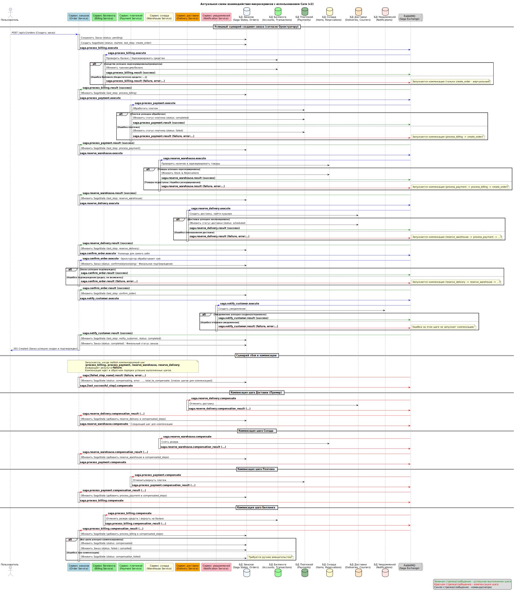

# Shop Helm Chart

Данный Helm чарт развертывает микросервисную архитектуру интернет-магазина, реализующую сагу для обработки заказов. Система состоит из следующих сервисов:
- Order Service (Сервис заказов) - Управление заказами и оркестрация саги
- Billing Service (Сервис биллинга) - Управление балансом пользователей
- Payment Service (Сервис платежей) - Обработка платежных транзакций
- Warehouse Service (Сервис склада) - Управление товарами и резервирование
- Delivery Service (Сервис доставки) - Управление доставкой
- Notification Service (Сервис уведомлений) - Отправка уведомлений пользователям

Также чарт включает необходимую инфраструктуру:
- PostgreSQL (для хранения данных)
- RabbitMQ (для асинхронного обмена сообщениями и реализации саги)
- Mailhog (для эмуляции SMTP сервера и просмотра отправленных email)

## Требования

- Kubernetes 1.19+
- Helm 3.2.0+
- Настроенный Ingress Controller (NGINX)
- Доступ к реестру Docker образов, содержащему образы сервисов

## Установка

1. Клонируйте репозиторий с чартом:
```bash
git clone https://github.com/director74/dz8_shop_chart
cd dz8_shop_chart
```

2. Установите чарт:
```bash
helm install shop ./
```

Примечание: Namespace "dz8" будет создан автоматически при использовании флага --create-namespace. Если вы хотите использовать другой namespace, укажите его в параметре values.yaml (global.namespace) и в команде установки.

## Настройка

Конфигурация чарта осуществляется через файл `values.yaml`. Основные параметры:

- `global.namespace` - Namespace для установки всех ресурсов
- `global.ingress` - Настройки Ingress
- `global.jwt` - Настройки JWT для авторизации между сервисами
- `global.postgresql` - Общие настройки PostgreSQL
- `global.rabbitmq` - Общие настройки RabbitMQ

Каждый сервис имеет свои параметры конфигурации:
- `order`, `billing`, `payment`, `warehouse`, `delivery`, `notification` - Настройки соответствующих сервисов
- `postgres`, `rabbitmq`, `mailhog` - Настройки инфраструктуры

## Доступ к сервисам

### API Endpoints

- Order Service API: http://arch.homework/api/v1/orders, http://arch.homework/api/v1/auth, ...
- Billing Service API: http://arch.homework/api/v1/billing, http://arch.homework/api/v1/accounts, ...
- Payment Service API: http://arch.homework/api/v1/payments, ...
- Warehouse Service API: http://arch.homework/api/v1/warehouse, ...
- Delivery Service API: http://arch.homework/api/v1/delivery, ...
- Notification Service API: http://arch.homework/api/v1/notifications, ...

### Интерфейсы управления

- RabbitMQ Management UI: http://arch.homework/rabbitmq/
  - Логин/пароль: значения из `global.rabbitmq.auth.username`/`global.rabbitmq.auth.password` (по умолчанию: guest/guest)

- Mailhog UI (просмотр отправленных писем): http://arch.homework/mailhog/
  - Не требует аутентификации

## Миграции баз данных

Миграции баз данных выполняются автоматически при установке или обновлении чарта через Kubernetes Jobs.

## Архитектура JWT аутентификации

В системе реализован единый механизм аутентификации:
- Все сервисы используют общий ключ подписи JWT (JWT_SIGNING_KEY)
- Общие настройки для JWT_TOKEN_ISSUER и JWT_TOKEN_AUDIENCES
- Токен, выданный одним сервисом, принимается всеми другими сервисами
- Передача токена между сервисами происходит в заголовке Authorization
- Пользователю достаточно один раз пройти аутентификацию для доступа ко всем сервисам

## Сага для обработки заказов

Процесс обработки заказа реализован через паттерн Сага с оркестрацией. Основные шаги:

1. Создание заказа (Order Service)
2. Обработка биллинга - списание средств (Billing Service)
3. Обработка платежа (Payment Service)
4. Резервирование товаров на складе (Warehouse Service)
5. Резервирование доставки (Delivery Service)
6. Подтверждение заказа (Order Service)
7. Отправка уведомления клиенту (Notification Service)

Сага поддерживает механизм компенсации при ошибках. Например, если на шаге резервирования товаров произойдет сбой, запустится процесс компенсации, который отменит предыдущие успешные шаги:
- Возврат платежа (Payment Service)
- Возврат средств на счет пользователя (Billing Service)
- Отмена заказа (Order Service)

### Компоненты системы

Система состоит из следующих компонентов:
- Микросервисы (Order, Billing, Payment, Warehouse, Delivery, Notification)
- База данных PostgreSQL с отдельными схемами для каждого сервиса
- Очереди сообщений RabbitMQ для асинхронного взаимодействия
- Ingress для маршрутизации внешних запросов

Коммуникация между сервисами происходит через:
1. Синхронные REST API вызовы (с JWT-авторизацией)
2. Асинхронное взаимодействие через очереди сообщений RabbitMQ

## Тестирование

Для тестирования API предоставляется Postman коллекция:
- Коллекция для Kubernetes: `/tests/dz8/saga_test_collection.json` (использует hostname arch.homework)

### Запуск автотестов с помощью Newman

```bash
newman run ./tests/dz8/dz8_postman_collection.json -e ./tests/dz8/k8s-environment.json
```

Тесты проверяют следующие сценарии:
- Регистрация и авторизация пользователя
- Создание аккаунта в биллинге
- Пополнение баланса
- Создание успешного заказа (полный процесс саги)
- Проверка списания средств
- Тестирование отказов различных шагов саги:
  - Неудачный платеж (недостаточно средств)
  - Неудачное резервирование на складе (нет товара)
  - Неудачная доставка (неверный адрес)
- Проверка отправки уведомлений при успешных и неудачных сценариях

## Документация

### API Спецификация (Swagger)

Полную спецификацию API можно найти в файле [swagger.yaml](docs/dz8/swagger.yaml).

## Визуальные материалы

### Диаграмма последовательности саги



